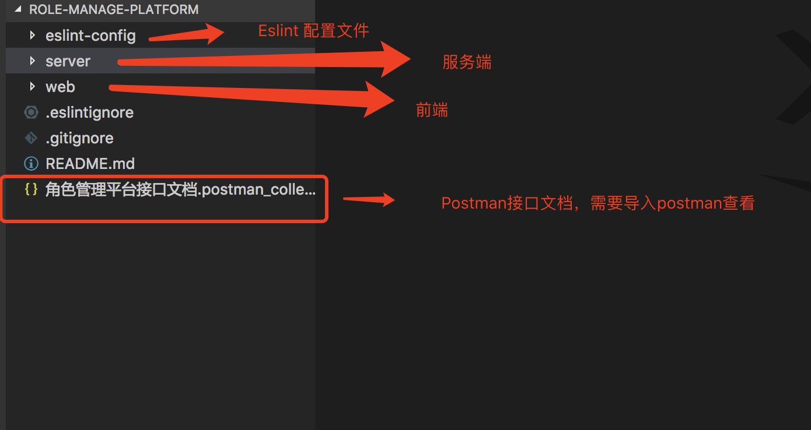
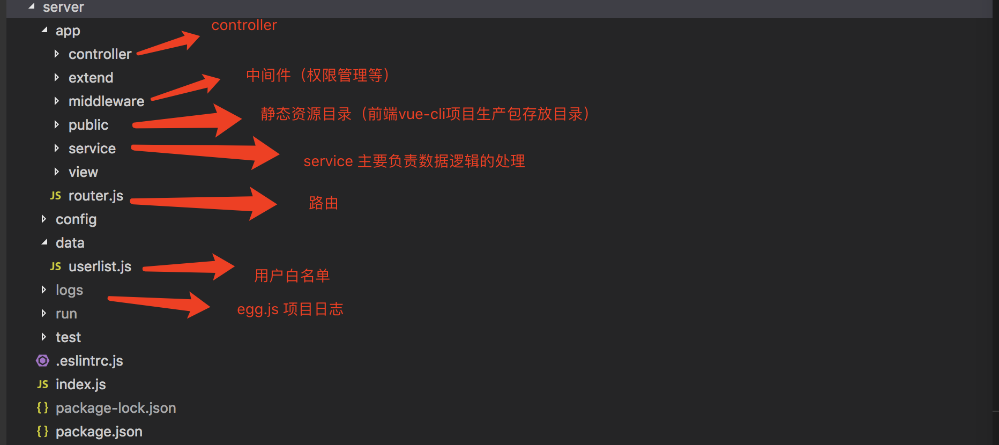

## 角色管理平台
## 启动服务
 1. cd server
 2. npm install
 3. npm run dev

 （请手动修改／server/config目录下的plugin.js、config.default.js相关端数据库地址配置）

## 项目概述
1. 后端：Egg.js basic-auth (接口权限认证)  jsonwebtoken( egg-jwt, web端token验证)  MySQL  Redis (sessionRedis) 
2. 前端：Vue.js全家桶( vuex + axois + element-ui + vue-router )
3. 后端接口已经测试完善
4. web端仅供测试参考

(由于做了接口权限管理，不同系统间不能相互访问，所以web端暂时不做token验证。)

## 目录结构



## 接口说明
1. Authorization 类型为 Basic-Auth

```javascript
// 以Axios为例，每次请求(除登录、登出外，或在请求拦截器中)携带要访问的 系统名称和系统密码，只能访问匹配的系统
Axios({
      url: '/role-manage/xxxx',
      data: that.form,
      method: 'post',
      auth: {
        username: SYSTEM_NAME, // 系统名称
        password: SYSTEM_PASSWORD, //  系统密码
      },
    }).then...
```
2. 非特别说明，所有列出了参数均为必填
2. 接口返会数据类型： JSON/String
3. 通用格式说明：/

```javascript
// 成功返回数据
{
  code: 1,
  data: [...{}],
  msg: '返回说明' 
}
// 失败
{
  code: 0,
  msg: '返回的失败信息'
}
// 权限
'无权限跨系统访问!'
```

## 


       

